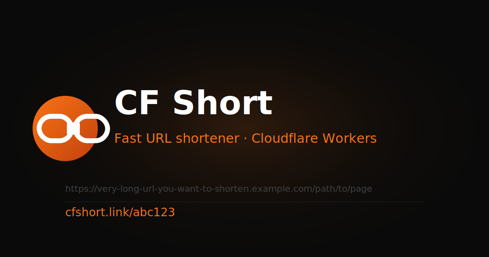

# CF Short

> A fast, minimal, open-source URL shortener powered by **Next.js 16** and **Cloudflare Workers** with **KV storage**.



## Features

- **Edge-native** — runs entirely on Cloudflare Workers, zero cold starts
- **KV storage** — durable, globally replicated short-link persistence
- **Custom slugs** — choose your own short path or get one auto-generated
- **Click tracking** — lightweight, privacy-respecting hit counter
- **Modern UI** — responsive design with light/dark mode support
- **Open source** — deploy your own instance in minutes

## Stack

| Layer     | Technology                        |
|-----------|-----------------------------------|
| Framework | Next.js 16 (App Router)           |
| Runtime   | Cloudflare Workers (edge)         |
| Storage   | Cloudflare KV                     |
| Styling   | Tailwind CSS v4                   |
| Adapter   | `@cloudflare/next-on-pages`       |
| Language  | TypeScript                        |

## Getting Started

### Prerequisites

- Node.js ≥ 20
- A [Cloudflare account](https://dash.cloudflare.com/sign-up) (free tier works)
- Wrangler CLI (installed as a dev dependency)

### Local development

```bash
# Install dependencies
npm install

# Start the Next.js dev server
npm run dev
```

Open [http://localhost:3000](http://localhost:3000).

> **Note:** In local development the KV binding is not available. The `/api/shorten` and redirect routes require the Cloudflare edge environment. Use `npm run cf:preview` (see below) to test with a local KV simulation.

### Preview with Cloudflare (local)

```bash
# 1. Create a KV namespace (one-time)
npx wrangler kv namespace create CF_SHORT_KV
# Note the `id` returned and update wrangler.jsonc

npx wrangler kv namespace create CF_SHORT_KV --preview
# Note the `preview_id` and update wrangler.jsonc

# 2. Build & preview locally with Wrangler
npm run cf:preview
```

## Deploy to Cloudflare Pages

```bash
# 1. Make sure wrangler.jsonc has your real KV namespace IDs (see above)

# 2. Set your BASE_URL in wrangler.jsonc vars section
#    e.g. "BASE_URL": "https://cf-short-next.pages.dev"

# 3. Deploy
npm run cf:deploy
```

Wrangler will prompt you to log in on the first run.

### Environment variables

| Variable   | Description                        | Default                             |
|------------|------------------------------------|-------------------------------------|
| `BASE_URL` | Public base URL of the deployment  | Derived from request `host` header  |

Set `BASE_URL` in `wrangler.jsonc` under `vars` or as a Pages environment variable in the Cloudflare dashboard.

## Project Structure

```
app/
  layout.tsx          # Root layout with Header, Footer, meta tags
  page.tsx            # Home page (hero + shortener form)
  not-found.tsx       # 404 page
  [slug]/
    route.ts          # Edge redirect handler (GET /[slug])
  api/
    shorten/
      route.ts        # POST /api/shorten — create short link
    stats/
      [slug]/
        route.ts      # GET /api/stats/[slug] — click stats
components/
  Header.tsx
  Footer.tsx
  ShortenerForm.tsx   # Client-side form with copy-to-clipboard
  FeatureCards.tsx
lib/
  kv.ts               # Cloudflare KV helpers
  utils.ts            # Slug generation & URL validation
public/
  logo.svg
  icon-512.svg
  og-image.svg
  manifest.json
wrangler.jsonc        # Cloudflare Workers / Pages config
```

## API

### `POST /api/shorten`

**Body** (JSON):

| Field        | Type   | Required | Description                        |
|--------------|--------|----------|------------------------------------|
| `url`        | string | yes      | The long URL to shorten            |
| `customSlug` | string | no       | Custom slug (3–32 alphanumeric chars) |

**Response 201**:
```json
{ "slug": "abc123", "shortUrl": "https://your-domain.pages.dev/abc123" }
```

### `GET /[slug]`

Redirects (302) to the original URL. Returns 404 if the slug does not exist.

### `GET /api/stats/[slug]`

Returns click count and creation timestamp for a given slug.

## License

MIT — see [LICENSE](LICENSE).

---

Made with ♥ by [manalejandro](https://github.com/manalejandro)

